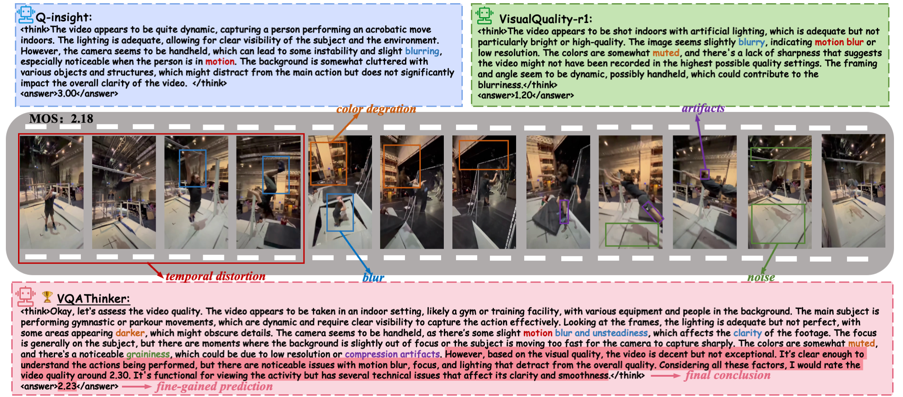
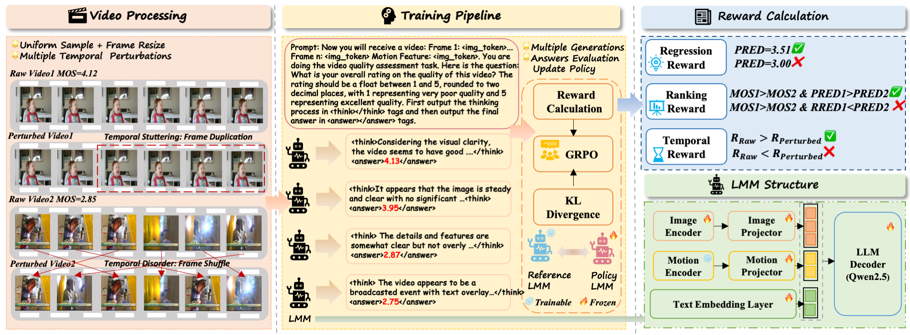

<div align="center">

# VQAThinker: Exploring Generalizable and Explainable Video Quality Assessment via Reinforcement Learning


 <div>
    <a href="https://arxiv.org/pdf/2508.06051"></a>
    <a href="https://huggingface.co/kkkkkklinhan/InternVL3-VQAThinker-8B"></a>
   </div>

  <div>
      <a href="https://scholar.google.com/citations?user=WmE6necAAAAJ&hl=zh-CN" target="_blank">Linhan Cao</a><sup>1</sup><sup>*</sup>,
      <a href="https://scholar.google.com/citations?hl=zh-CN&user=nDlEBJ8AAAAJ" target="_blank">Wei Sun</a><sup>2</sup><sup>*</sup>,
      <a href="https://scholar.google.com/citations?hl=zh-CN&user=KK2nLnQAAAAJ" target="_blank">Weixia Zhang</a><sup>1</sup>,
      <a href="https://scholar.google.com/citations?hl=zh-CN&user=k7YfbnEAAAAJ" target="_blank">Xiangyang Zhu</a><sup>3</sup>,
      Jun Jia<sup>1</sup>,
  </div>

<div>
      Kaiwei Zhang<sup>1</sup>,
      <a href="https://faculty.ecnu.edu.cn/_s47/zdd/list.psp" target="_blank">Dandan Zhu</a><sup>2</sup>,
      <a href="https://ee.sjtu.edu.cn/en/FacultyDetail.aspx?id=24&infoid=153&flag=153" target="_blank">Guangtao Zhai</a><sup>1</sup>
      <a href="https://scholar.google.com/citations?user=91sjuWIAAAAJ&hl=zh-CN&oi=ao" target="_blank">Xiongkuo Min</a><sup>1</sup><sup>#</sup>,
      
  </div>

  <div>
  <sup>1</sup>Shanghai Jiaotong University,  <sup>2</sup>East China Normal University, <sup>3</sup>Shanghai Artificial Intelligence Laboratory
       </div>   
<div>
<sup>*</sup>Equal contribution. <sup>#</sup>Corresponding author. 


This is the official code of VQAThinker, the first open-source NR-VQA model enhanced via reinforcement learning, capable of performing both video quality scoring and understanding.

<p align="center">
    
</p>


<div align="left">

## Abstract

Video quality assessment (VQA) aims to objectively quantify perceptual quality degradation in alignment with human visual perception. Despite recent advances, existing VQA models still suffer from two critical limitations: *poor generalization to out-of-distribution (OOD) videos* and *limited explainability*, which restrict their applicability in real-world scenarios. 

To address these challenges, we propose **VQAThinker**, a reasoning-based VQA framework that leverages large multimodal models (LMMs) with reinforcement learning to jointly model video quality understanding and scoring, emulating human perceptual decision-making. 

Specifically, we adopt group relative policy optimization (GRPO), a rule-guided reinforcement learning algorithm that enables reasoning over video quality under score-level supervision, and introduce three VQA-specific rewards:  
1. a **bell-shaped regression reward** that increases rapidly as the prediction error decreases and becomes progressively less sensitive near the ground truth;  
2. a **pairwise ranking reward** that guides the model to correctly determine the relative quality between video pairs; and  
3. a **temporal consistency reward** that encourages the model to prefer temporally coherent videos over their perturbed counterparts.  

Extensive experiments demonstrate that VQAThinker achieves state-of-the-art performance on both in-domain and OOD VQA benchmarks, showing strong generalization for video quality scoring. Furthermore, evaluations on video quality understanding tasks validate its superiority in distortion attribution and quality description compared to existing explainable VQA models and LMMs. These findings demonstrate that reinforcement learning offers an effective pathway toward building generalizable and explainable VQA models solely with score-level supervision.

## Model Architecture

<p align="center">
    
</p>


<div align="left">

## Release
- [08/11/25] 🤗 Released the inference code.


## Installation

```bash
conda create -n vqathinker python=3.11
conda activate vqathinker
bash setup.sh
```

## Quick Inference


### 1. Download model weights

You need to download the pre-trained model weights before running inference: [InternVL3-VQAThinker-8B](https://huggingface.co/kkkkkklinhan/InternVL3-VQAThinker-8B).


The weights should be saved in the folder `InternVL3-VQAThinker-8B/`.

---


### 2. Single video quality evaluation

```shell
cd test
python single_infer.py
```

Before running, please modify the parameters in `single_infer.py`:

- **MODEL_PATH** - set this to the directory containing the pre-trained weights.  
- **video_path** - set this to the actual path of your test video.

---


### 3. Batch videos quality evaluation

```shell
cd test
python batch_infer.py
```

This script is used to evaluate the **10 datasets** reported in the paper.

Before running, please modify the parameters in `batch_infer.py`:

1. **MODEL_PATH** — set this to the directory containing the pre-trained weights.  
2. **video_paths** — set this to the correct folder path containing the videos to be tested.  
3. **json_prefix** — this folder should contain the meta JSON files for the 10 datasets to be evaluated.  
4. **csv_output_folder** — set this to the folder where you want the results to be saved.  

**Note:** The default `batch_size` is **16**, which requires **at least 48 GB of GPU memory** for testing.  
Adjust `batch_size` according to your available GPU memory.


